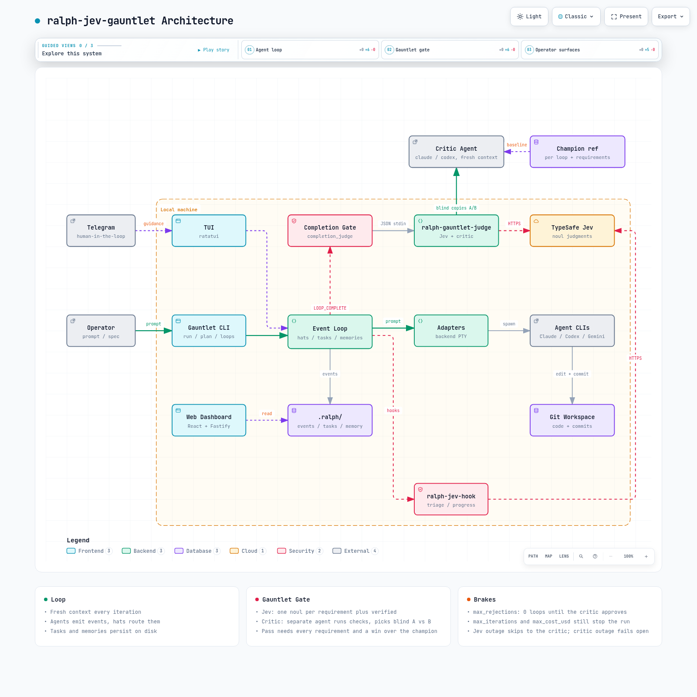
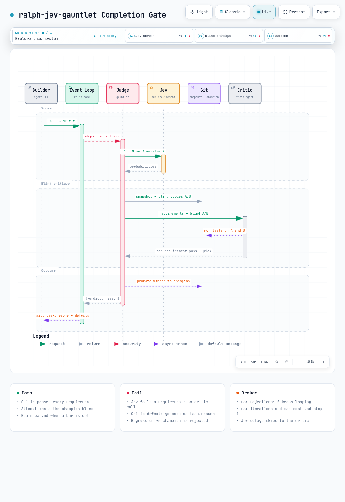

# ralph-jev-gauntlet

An autonomous agent loop that only ends when a separate critic agent approves the work in a blind comparison.

ralph-jev-gauntlet builds on [ralph-jev](https://github.com/flaviomartil/ralph-jev) (a Ralph-style agent loop with a [TypeSafe Jev](https://typesafe.ai) completion judge) and adds the Gauntlet Loop pattern: builder and critic are different agents, the critic compares attempts blind instead of giving a score, and the loop keeps going until the work wins.



## Why

An agent that grades its own work almost always passes. Numeric scores from a model creep upward every round until everything is "8/10, ship it". The gauntlet removes both problems:

- **Separate critic.** A fresh agent (Claude Code or Codex) that never saw the build conversation opens the files, runs the tests itself and checks each requirement.
- **Blind comparison, no score.** The current attempt and the best attempt so far are checked out as `A` and `B` in random order. The critic picks the better one without knowing which is newer.
- **Cheap screen first.** Jev answers one yes/no question per requirement in about a second, so the expensive critic only runs when the attempt already looks complete.
- **Run until it wins.** `max_rejections: 0` removes the rejection budget. `max_iterations` and `max_cost_usd` still stop a runaway loop.

## How the gauntlet gate works



When the builder emits `LOOP_COMPLETE`, the loop runs its built-in checks (required events, acknowledged guidance, no open tasks) and then calls `ralph-gauntlet-judge`.

**1. Requirements**

The judge takes the list of requirements from the first of these that it finds:

1. Bullets in `.ralph/gauntlet/criteria.md`.
2. An `Acceptance criteria`, `Definition of done` or `Requirements` section in the objective.
3. Checkboxes in the objective.
4. The whole objective as a single requirement.

**2. Jev screen**

The judge collects evidence (commits, `git status`, diff stat, closed tasks, recent events) and asks Jev:

| Question | Threshold | Env var |
|---|---|---|
| `c1`..`cN`: is requirement N met? | 0.5 each | `RALPH_JEV_CRITERION_THRESHOLD` |
| `verified`: did tests or a build actually run and pass? | 0.5 | `RALPH_JEV_VERIFIED_THRESHOLD` |

If any answer falls below its threshold, the attempt is rejected right away and names the failing requirements. The critic does not run. If Jev is unreachable, the judge skips this step and goes straight to the critic.

**3. Blind critique**

1. The judge snapshots the workspace, including uncommitted and untracked files, without touching your index or branch.
2. The snapshot and `refs/gauntlet/champion` (the best attempt so far) are checked out as temporary git worktrees labeled `A` and `B` at random.
3. The critic gets the requirements and both directories. It runs the checks and replies with a pass or fail per requirement, a `pick`, and a list of concrete defects.
4. When `.ralph/gauntlet/bar.md` exists, the critic also has to beat that reference (a named page, repo or document it can open).

**4. Verdict**

- **pass:** every requirement passes for the attempt, the attempt wins the blind pick (or there is no champion yet), and it beats the bar when one is set.
- **fail:** the critic's failing requirements and defects go back to the builder as `task.resume`, for example:

```
Completion rejected by judge: critic: requirements failing: c1 "An <h1> header appears before the <p> tag"
(line 1 <p>, line 2 <h1>: h1 comes after p). critic: blind comparison preferred the previous best attempt,
so this attempt regressed. defects: move <h1>Hello</h1> above <p>hi</p> | test.sh keeps the last match, record the first
```

Whenever the attempt wins the blind pick, it becomes the new champion, so every later attempt has to beat the best one so far. The temporary worktrees are removed after every run.

## Other Jev decision points

| Point | Event | Jev questions | Effect |
|---|---|---|---|
| Triage | `pre.loop.start` | `difficulty` (score), `ambiguous` (noul) | Warns when `max_iterations` is low or the objective has no definition of done |
| Progress watchdog | `pre.iteration.start` | `stalled` (noul) | Flags a loop that keeps repeating the same step or failure |

Both run through `ralph-jev-hook <triage|progress>`. They write their scores to hook metadata, print a warning on stderr, and exit non-zero when their threshold is crossed. `on_error` (`warn`, `block` or `suspend`) decides what happens next.

## Install

Requirements: Rust (edition 2024), Node.js 18+, git, a builder agent CLI, and a critic CLI (`claude` or `codex`).

```bash
git clone https://github.com/flaviomartil/ralph-jev-gauntlet.git
cd ralph-jev-gauntlet
jev/install.sh
```

This links `ralph-jev-gauntlet`, `ralph-gauntlet-judge`, `ralph-jev-judge` and `ralph-jev-hook` into `~/.local/bin`, and adds `jev/ralph.gauntlet.yml` to `~/.ralph/config.yml` when it can do so without conflicts.

Jev credentials: set `TYPESAFE_API_KEY`, or keep it in `~/.config/jev-browser-use/.env`.

## Usage

```bash
ralph-jev-gauntlet run -p "$(cat <<'EOF'
Add a header before the <p> tag.

## Acceptance criteria
- An <h1> header appears before the <p> tag in index.html
- A test script verifies the header order and passes
EOF
)" --max-iterations 30
```

Per-project configuration in `ralph.yml`:

```yaml
event_loop:
  max_cost_usd: 20
  completion_judge:
    command: ["ralph-gauntlet-judge"]
    timeout_seconds: 900
    max_rejections: 0
    fail_closed: false
```

Optional files:

| File | Purpose |
|---|---|
| `.ralph/gauntlet/criteria.md` | Requirements as bullets, overriding the ones parsed from the objective |
| `.ralph/gauntlet/bar.md` | A real reference the work must beat: a URL, a path or a named artifact the critic can open |

Environment:

| Variable | Default | Purpose |
|---|---|---|
| `RALPH_GAUNTLET_CRITIC` | `claude` | `claude` or `codex` |
| `RALPH_GAUNTLET_CRITIC_CMD` | unset | Custom critic argv as JSON; the prompt arrives on stdin |
| `RALPH_GAUNTLET_CRITIC_TIMEOUT_MS` | 600000 | Critic time limit |
| `RALPH_GAUNTLET_VERIFY_HINT` | unset | How to verify, for example `npm test` |
| `RALPH_GAUNTLET_ALLOW_TIE` | unset | `1` accepts a tie against the champion |
| `RALPH_GAUNTLET_WORKDIR` | system temp | Where snapshots and worktrees go |

The critic runs non-interactively inside throwaway worktrees (`claude -p --permission-mode bypassPermissions` or `codex exec -s workspace-write`), so it can run your tests without asking. It is told not to edit source files, and your working tree is never checked out or modified.

## Safety bounds

- `max_rejections: 0` means unlimited. Use `max_iterations` and `max_cost_usd` as the real brakes.
- If the critic fails or times out, the completion is accepted. Set `fail_closed: true` to reject instead.
- A 429 or 5xx from Jev pauses Jev calls for `JEV_COOLDOWN_MS`, and the critic still judges.

## Components

| Path | Role |
|---|---|
| `crates/ralph-core` | Event loop, hats, tasks, memories, hooks, completion gate |
| `crates/ralph-core/src/completion_judge.rs` | Runs the external judge (timeout, verdict parsing) |
| `crates/ralph-adapters` | Builder backends (Claude, Codex, Gemini, Kiro, Roo, ...) |
| `jev/ralph-gauntlet-judge.mjs` | Gauntlet judge: Jev screen, snapshot, blind worktrees, critic, champion |
| `jev/lib/gauntlet.mjs` | Requirement parsing, critic prompt, verdict rules |
| `jev/ralph-jev-judge.mjs` | Jev-only judge, for when you want no critic |
| `jev/ralph-jev-hook.mjs` | Jev triage and progress hooks |
| `jev/lib/jev.mjs` | Jev client, circuit breaker, evidence collection |
| `jev/test/` | Node tests, including an end-to-end run with a scripted critic |
| `docs/architecture/` | Archify specs and renders |

## Development

```bash
cargo test -p ralph-core completion_judge
node --test jev/test/*.test.mjs
```

The Node suite has about 1,850 tests: fixed tables for known edge cases, plus seeded property cases that check requirement parsing, the Jev screen, the blind verdict rules and critic output parsing against an independent oracle. The end-to-end tests run the real judge against temporary git repositories with a scripted critic, so they check snapshots, blind worktrees, champion promotion, cleanup, and that your workspace and index are left untouched.

## Credits

- The Ralph loop technique, for the fresh-context agent loop.
- The Gauntlet Loop, Matt Shumer's builder and critic pattern with blind comparison.

## License

MIT. See [LICENSE](LICENSE).
