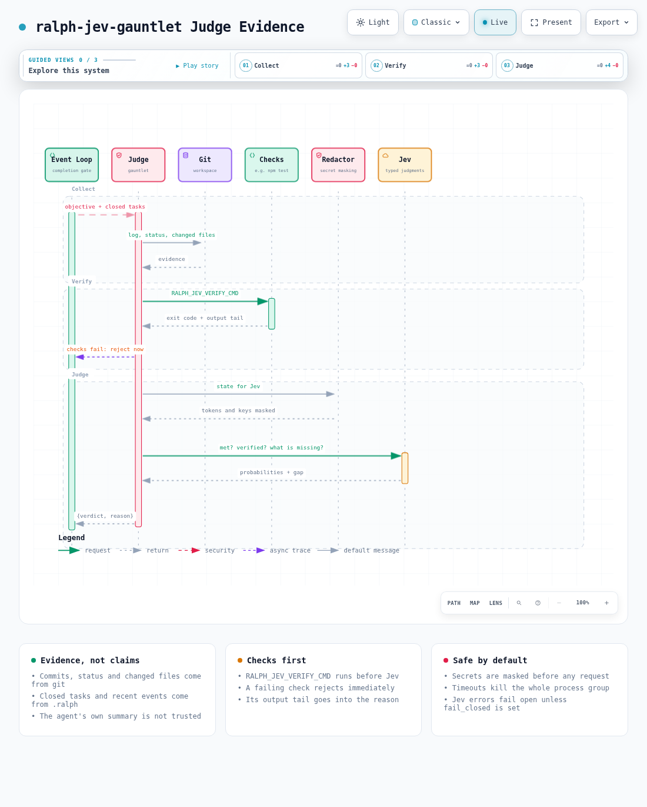

# Judge evidence

[Open the interactive diagram](../architecture/judge-evidence.html)

The judge never trusts the agent's own summary. It reads what actually happened.

## What is collected

- Recent commits, `git status`, and the diff stat of changed files.
- Closed tasks, sent by the loop.
- The last events from the current events file in `.ralph/`.
- The result of `RALPH_JEV_VERIFY_CMD`, when set.

## Checks run first

When `RALPH_JEV_VERIFY_CMD` is set (for example `npm test`), the judge runs it in the workspace before asking Jev, with a `RALPH_JEV_VERIFY_TIMEOUT_MS` limit (default 5 minutes). A failure rejects the attempt immediately, with the end of the output in the reason. A pass goes into the evidence as `verification_run`, which is what Jev needs to answer `verified` with confidence. The command also becomes the critic's hint on how to verify.

## What reaches Jev

Everything sent to Jev (command output, events, commits, the objective) first goes through a redactor that masks common token formats, `Bearer` headers, credentials in URLs, private keys, and `key=value` pairs whose name looks like a secret.

## Processes

The judge, the verify command, the critic and the loop's judge call all run in their own process groups. On timeout the whole group is killed, and output kept in memory is capped, so a runaway command can't hang or flood the loop.
