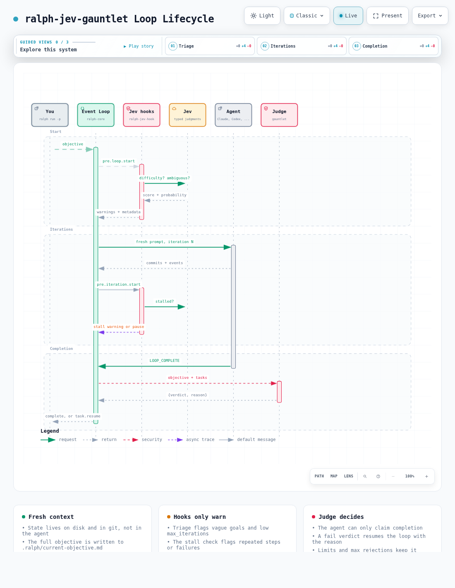

# Loop lifecycle

[Open the interactive diagram](../architecture/loop-lifecycle.html)

## Start

1. `ralph-jev-gauntlet run` resolves the objective: `-p` text, `-P` file, the config `prompt`/`prompt_file`, or `PROMPT.md`.
2. The full objective is written to `.ralph/current-objective.md` in the loop's own workspace. The loop lock only keeps a 100 character summary, so the hooks read this file instead.
3. `pre.loop.start` runs the Jev triage hook: it warns when the objective has no definition of done or when `max_iterations` looks low.

## Iterations

Every iteration builds a fresh prompt from the objective, hats, tasks, memories and pending events, then runs the agent. The agent works in the repository, commits, and emits events. Nothing carries over in the agent's context: anything that matters has to be on disk or in git.

From iteration 3 on, `pre.iteration.start` runs the Jev stall check. It looks at the last events, commits and tasks and warns when the loop keeps repeating the same step or failure.

## Completion

When the agent emits `LOOP_COMPLETE`, the loop first runs its built-in checks (required events seen, human guidance acknowledged, no open tasks). Then it calls the external judge configured in `event_loop.completion_judge`, `ralph-gauntlet-judge` by default. See [Gauntlet gate](../concepts/gauntlet.md).

- **pass**: the loop ends.
- **fail**: the loop publishes `task.resume` with the reason and keeps going.

## Always ends

- `max_iterations` and `max_cost_usd` stop any loop.
- After `max_rejections` rejections the completion is accepted (`0` means unlimited).
- If the judge errors or times out, the completion is accepted unless `fail_closed: true`.
